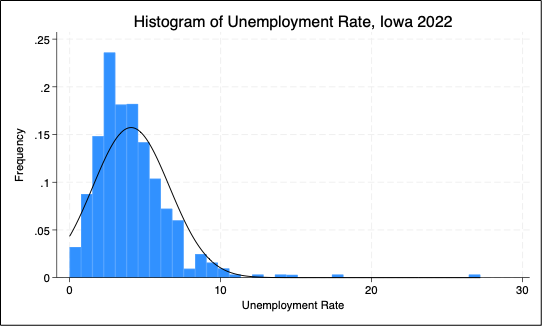
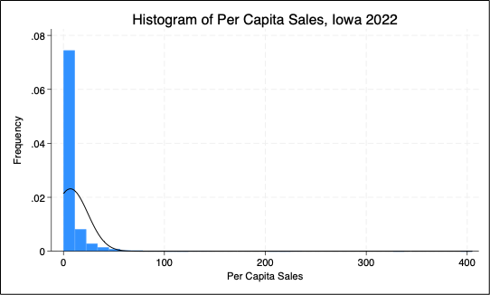
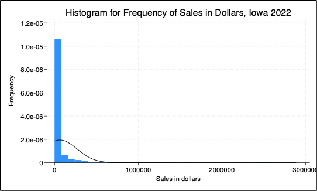

# ADAN-ADEC7900 Group 1

Video Presentation can be viewed [here]().

# Introduction
### Research Question

*What is the distribution of per capita sales across geographies? What are the ranks of the top 10 geographies for per capita consumption across every liquor category? Are there any outliers that have high per capita sales in only one specific liquor category?* 

Our goal was to analyze regional liquor consumption trends, identify high-spending areas, and uncover patterns in consumer preferences to optimize inventory needs. Focusing on Iowa's four congressional districts—northeast, northwest, southeast, and southwest—we examined overall liquor demand and the popularity of different liquor categories in each region. This analysis could help distribution companies make data-driven decisions about inventory management and resource allocation, ensuring efficient supply chain operations and tailored marketing strategies to meet regional demands effectively. By understanding these consumption trends, distribution companies can better serve their customers and maintain a competitive edge in the market.

### Decision Maker
We planned for our research to be used by the Senior VP of Distribution and Logistics for Iowa Beverage, a beer, wine, and spirit distribution company that serves the state of Iowa. By understanding high-spending areas and consumer preferences, the VP could take the necessary actions to enhance efficiency, reduce waste, and better meet market demands for the 2025-2026 fiscal year, ultimately driving profitability and customer satisfaction.

# Data Summary
The two datasets utilized in this study provide insights into both Iowa liquor sales from 2012 to 2016 across a wide range of categories, as well as into various economic and demographic variables across Iowa geographies (zip code, city, or county). The combination of such datasets enabled us to explore regional liquor consumption trends, identify high-spending areas, and uncover potential patterns in consumer preferences.

To provide some specificity, the data on Iowa liquor sales is sourced from the Iowa Department of Revenue, while the economic and demographic information is derived from the American Community Survey (ACS).

The first dataset provides aggregated information on liquor sales in Iowa, organized into three geographic levels: zip codes, cities, and counties. Each file contains data on liquor categories (Amaretto, Brandy, Distilled Spirits, Gin, Misc., Rum, Schnapps, Tequila, Vodka, Whiskey), average annual sales in dollars, and average annual volume sold in liters. This structure allows for the analysis of regional liquor consumption trends, helping to identify high-spending areas and popular liquor categories. However, the dataset is limited by its aggregation to annual averages, which obscures seasonal or short-term trends. Additionally, the absence of brand-level data or finer geographic details restricts deeper insights into consumer preferences and behaviors.

As mentioned, the second dataset comes from the ACS. The American Community Survey (ACS) is a yearly survey conducted by the United States Census Bureau that collects data on the U.S. population’s demographics, social characteristics, economy, and housing throughout the course of a year. The ACS surveys about 3.5 million housing units across the U.S. each year, randomly selecting a sample of about 250,000 addresses each month. This dataset provides a comprehensive overview of socio-economic and demographic characteristics, including educational attainment, economic metrics, and racial composition. It captures the percentage of the population with at least a high school diploma and those with a bachelor's degree or higher, alongside the unemployment rate and median earnings. Additionally, it details the total population and its distribution across various racial and ethnic groups, including white, black, Asian, Native Hawaiian, American Indian, and multiracial categories. While the ACS remains both a crucial and credible tool for understanding and addressing community needs and trends, it does come with its implications. Given that the ACS is based on a sample rather than a full count, there is a degree of uncertainty associated with the estimates. Moreover, while the randomization that the ACS relies on can reduce bias, it can also lead to the underrepresentation of certain groups.

In an effort to derive more insightful conclusions, we merged the two datasets and grouped them by geographic information (i.e., zip code, city, county). For example, we combined the data on average annual liquor sales per zip code with ACS data on Iowa zip codes into a singular dataset titled ‘merged_zipcode_data’. This simplification left us with three datasets that we then leveraged for our analysis.

### <ins>Here are quick summaries for the three datasets:<ins> 

**$\color\{Green}{Merged\ Cities\ Data}$**
| Field | Type |
| --- | --- |
| city | character |
| category | character |
| sale.dollars | integer |
| sale.volume | integer |
| high.school | numeric |
| bachelor | numeric |
| unemployment | numeric |
| income | integer |
| population | integer |
| pop.white | integer |
| pop.black | integer |
| pop.indian | integer |
| pop.asian | integer |
| pop.hawai | integer |
| pop.other | integer |
| pop.multi | integer |
| Total size of the dataset | $\color{Red}{328.7\ Kb}$ |
| Total number of rows in the dataset | $\color{Red}{3693}$ |

**$\color\{Green}{Merged\ County\ Data}$**
| Field | Type|
| --- | --- |
| county | character |
| category | character |
| sale.dollars | integer |
| sale.volume | integer |
| high.school | numeric |
| bachelor | numeric |
| unemployment | numeric |
| income | integer |
| population | integer |
| pop.white | integer |
| pop.black | integer |
| pop.indian | integer |
| pop.asian | integer |
| pop.hawai | integer |
| pop.other | integer |
| pop.multi | integer |
| Total size of the dataset| $\color{Red}{89.2\ Kb}$ |
| Total number of rows in the dataset| $\color{Red}{980}$ |

**$\color\{Green}{Merged\ ZipCode\ Data}$**
| Field| Type|
| ---|---|
| zipcode | integer |
| category | character |
| sale.dollars | integer |
| sale.volume | integer |
| high.school | numeric |
| bachelor | numeric |
| unemployment | numeric |
| income | integer |
| population | integer |
| pop.white | integer |
| pop.black | integer |
| pop.indian | integer |
| pop.asian | integer |
| pop.hawai | integer |
| pop.other | integer |
| pop.multi | integer |
| Total size of the dataset| $\color{Red}{325.3\ Kb}$ |
| Total number of rows in the dataset| $\color{Red}{4123}$ |

**<ins>City Dataset:<ins>**
This dataset contains data on liquor sales by city, including categories of alcohol (e.g., whisky, vodka) with corresponding sales in dollars and volume. It also includes socio-economic and demographic variables such as high school and bachelor's degree attainment rates, unemployment rates, median income, total population, and racial breakdowns.

**<ins>Zip Code Dataset:<ins>**
The zip code dataset details liquor sales categorized by alcohol type, along with sales volume and revenue. It also captures demographic data, including education levels, unemployment rates, median income, total population, and racial composition within specific zip codes.

**<ins>County Dataset:<ins>**
This dataset aggregates liquor sales data at the county level, organized by alcohol category with sales volume and dollar amounts. It is supplemented by socio-economic indicators, such as education, unemployment, income, total population, and racial demographics, offering a broader view of trends across counties.

### Limitations
Perhaps it’s also important to note that using a full outer join in R was crucial to ensure complete data integration. Without it, the merged dataset could be incomplete. In other words, when combining ACS and annual sales data, it was essential to use a full outer merge because some ACS geographies might not have recorded liquor sales, and some sales geographies might not have corresponding ACS data.

Ultimately, combining the liquor sales data with ACS data helped to provide a richer context for analysis, but it did still result in some limitations to consider with respect to our analysis methodology. As mentioned, the sampling error in ACS data introduces uncertainty, particularly for small geographic areas. Temporal mismatches arise because liquor sales data is aggregated annually, while ACS data is collected continuously and reported over different periods. Geographic inconsistencies can occur due to differing boundaries, and both datasets' lack of granularity can obscure finer details. And lastly, contextual gaps exist as ACS data may not capture all factors influencing liquor sales, such as cultural preferences or local regulations. 

### Descriptive Statistics

**Figure 1.** Descriptive statistics for key variables across geographies by Iowa zip codes, cities, and counties in 2022. Median and IQR values are reported to account for data skewness to ensure most accurate reporting of averages. Note: IQR = interquartile range.

# Data Analytics
### Analytical Tools & Methods 
We used R, Tableau, and Stata to promote greater flexibility in our approach to the primary research and excursion analysis questions. First, we merged the ACS and liquor sales data in R by city, state, and zip code. Next, we imported the data to Tableau and created initial visualizations for each dataset and noted patterns. Given that the datasets used counts versus frequencies of each geography, we were unable to merge the datasets to create a unified dashboard. However, Tableau Public allowed us to publish our three dashboards to a single location to facilitate comparison across geographical categories. See our dashboards here: (<https://public.tableau.com/app/profile/taylor.bellfield/vizzes>).

#### Tableau
We used three types of visualizations for each dashboard to answer each objective of the primary research question. The **rank-labeled “heat map”** highlights the ranking dynamics, range, and magnitude of the top 10 cities by per capita consumption across each liquor category. The **box-and-whisker plot** identifies outliers in sales by category for these top cities. Our **geospatial maps** provide an overview of the distribution of liquor sales across cities, counties, and zip codes, allowing for comparisons across regions of the state. Together, these visualizations facilitated identification of regional patterns to support the Senior VP’s decision to increase distribution and marketing efforts in potentially high-yield areas of the state.

While Tableau was an excellent program for data visualization, it was limited in terms of collaborative utility. Unlike other collaborative platforms like Google Workspace and GitHub, Tableau lacks real-time collaboration features and version control. To overcome this limitation and ensure equal effort by each group member, we divided our work by dataset, with each member assigned to generate the visualizations for cities, counties, or zip codes. This process required careful coordination and consistent communication to ensure consistency and interpretability across each Tableau dashboard and Stata output.

#### GitHub
To facilitate collaboration and version control, we established a central GitHub repository. The repository was pivotal in enhancing our collaborative workflow as we were able to work together to complete markdown and README files, develop code in tandem, and create folders for sharing visualizations. GitHub’s flexibility and integration with R were particularly useful. However, there were some challenges at the outset, including the learning curve associated with using GitHub for the first time and some technical difficulties with file permissions and repository synchronization, which led to a group member’s work not being reflected in new branches. Despite these hurdles, GitHub streamlined our collaborative process and made it easy to keep up with the latest iterations of our work.

#### Stata
Finally, we used Stata to generate more accurate descriptive statistics and run our excursion analyses, which entailed generalized linear modeling to determine the effect of unemployment on total and per capita liquor sales. We loaded each dataset into Stata one at a time to generate descriptive statistics, then loaded and cleaned the zip code dataset alone for further analysis. We assessed the normality of our dependent variables (total and per capita sales) and independent variable (unemployment) to determine which regression model was most appropriate for predictive accuracy. Given that Stata, like Tableau, is not a collaborative platform, one group member, who was familiar with Stata, generated descriptive statistics and ran the excursion analyses independently, then shared the results in real time with the rest of the group to confirm methodological soundness and the accuracy of descriptive estimates against Tableau visualizations. While this method was not ideal, using Stata for this step allowed us to conduct more sophisticated statistical tests, enhanced the predictive strength of our analyses, and provided deeper insights not achievable through visualizations alone.

Our primary aim was to identify trends in liquor sales across Iowa geographies to support distribution decisions by our Senior VP for the upcoming fiscal year. Taking this three-pronged approach – using R for data merging, Tableau for data visualization, and Stata for statistical analysis – allowed us to conduct a rigorous investigation into each of our research objectives that provided essential information to support policy decisions at the organizational, local, and state levels.

### Questions of Interest
Note: If you would like to see the interactive versions of the visualizations described below, please follow the link to our Tableau Public page (<https://public.tableau.com/app/profile/taylor.bellfield/vizzes>) 

#### <ins>1. Identify the distribution of per capita sales across geographies.<ins>

**Figure 2a-c.** Geospatial maps of per capita liquor sales across Iowa cities, counties, and zip codes.

Median per capita sales for Iowa zip codes, cities, and counties were 3.6, 4.0, and 3.1, respectively. We reported the median because per capita sales data was extremely right-skewed, given that per capita sales were much higher in some areas compared to the majority of locales. For example, among the counties with the highest per capita sales, Dickinson had the highest value at 22.8. Similarly, for cities, Bevington had the highest per capita sales at 83.94. Finally, for zip codes, we see that 50033 had the most substantial per capita sales value at 110.6. Based on the distributions, it appears that geographies in the central, eastern, and northern regions of Iowa have the highest per capita sales, with specific cities, counties, and zip codes driving these patterns.

#### <ins>2. Identify the ranks of the top 10 geographies for per capita consumption across every liquor category.<ins>
<

**Figure 3a-c.** Heat maps for the geographies with the top 10 highest per capita liquor sales for Iowa cities, counties, and zip codes.

For the top 10 geographies in each liquor category, we see interesting patterns emerge regarding the types of alcohol consumed and their effect on per capita sales. As we observed in the geospatial map for cities, Bevington came out on top in per capita sales. However, the heat map tells a slightly different story, with Bevington having the highest per capita consumption in only two categories: Whisky and Vodka. Going down the rows, it becomes evident that Mount Vernon has the top per capita consumption in the most categories, including miscellaneous liquors, tequila, and distilled spirits. Furthermore, despite having the highest overall per capita sales, Bevtinton’s per capita consumption for Schnapps and Brandy ranked tenth, and there is no sales data for distilled spirits and amaretto. For the top 10 counties, a similar pattern emerges, where there are specific liquor categories with higher per capita consumption than others. The exception in this case is Dickinson, which ranks highest in all liquor categories except Brandy and distilled spirits. Zip code data was similarly distributed, where zip codes 50033, 52401, and 50314 held the top rankings for each liquor category. Based on heat maps, we can identify that specific kinds of liquors are popular in certain geographies, helping to further explain the trends described in part 1 of the analysis.

#### <ins>3. Determine if there are any outliers that have high per capita sales in only one specific liquor category.<ins>

**Figure 4a-c.** Box-and-whisker plots for the geographies with the top 10 highest per capita liquor sales for Iowa cities, counties, and zip codes.

Further extending our findings from part 2, part 3 allowed us to identify which liquor categories drove per capita sales across the top 10 geographies. We see that Bevington remains highest in the ranking, but interestingly, does not have any outlying liquor categories. In fact, none of the top 4 cities have outliers. It is not until Bancroft, Floyd, Fort Atkinson, and Holy Cross that we see Whisky stand out as the only outlier among the top 10 cities. For counties, we see a similar trend. Since Dickinson was ranked highest among counties in almost all categories, there were nbo outliers in its distribution of per capita sales. However, in addition to Whisky, we see that several counties had vodka as an outlier, namely Polk, Johnson, and Scott. These patterns were further asserted by the distributions for top 10 zip codes, where whisky aand vodka were the only outliers across several zip codes.

### Excursion Analysis
*Note: The Stata log and do files associated with the analyses are available upon request, but were omitted from the report for readability.*

#### Research question: *What is the relationship between unemployment and total and per capita liquor sales?* 

**Figure 5a-c.** Histograms for unemployment, total sales, and per capita sales showing right skewness.

Given the skewed distributions of the independent variable (unemployment) and the two dependent variables (total and per capita sales), we chose to run a generalized linear model instead of linear regression to enhance the accuracy of our estimations. To conduct the generalized linear model, we began by checking the relationship between variance and squared means for sales to determine the best model to use. We plotted the variance against the squared means, which confirmed that a linear regression model was not appropriate for determining the relationship between unemployment and sales. We then ran two models to determine which generalized linear model would produce the best fit: we first ran a gamma log model and then a Gaussian log model, finding that the gamma log model had the best fit for both outcomes.

**Figure 6a-b.** Results of the generalized linear modeling show the gamma log model to be superior, given the lower AIC and BIC values and the significant coefficients indicating the relationship with total and per capita sales. Linear relationship between variance and sqaured means of total sales indicates gamma log model may be most appropriate.

Based on the gamma log model, we can conclude that, controlling for education and income, a higher unemployment rate is associated with a 20% increase in total liquor sales and a 4% increase in per capita liquor sales. In these models, zip codes with higher school graduation rates had lower total sales but did not differ from other geographies in per capita sales. Zip codes with higher proportions of residents with bachelor's degrees had higher total and per capita sales. Higher average median income was associated with slight reductions in total and per capita sales.

# Conclusion
Based on our analyses, per capita sales appear concentrated in the central, eastern, and northern regions of Iowa with notable variations across cities, counties, and zip codes. While cities like Bevington appeared to have the highest overall per capita sales across cities, per capita consumption data revealed that this trend was driven largely by whiskey and vodka. It would be critical to increase liquor sales distribution in the aforementioned regions and locales. Further analysis of the income distributions in these regions is warranted given the results of the gamma log model, as it appearts that higher income areas with lower unemployment may not consume as much liquor. Therefore, it may be worthwhile to market liquors as high-end to target consumers in morte affluent parts of the state with lower per capita consumption.

# Policy Recommendations
A primary goal for the distribution and marketing strategy will be increasing distribution by 20% for whisky and vodka across the central, eastern, and northern regions of Iowa. Specifically, these efforts should be targeted at high-sales areas like Bevington, Mount Vernon, and Dickinson County. Additionally, the Senior VP would benefit from optimizing the mix of inventory based on regional preferences. Whisky and vodka were main contenders for most areas, but there were specific exceptions that may be worthwhile to explore further. Finally, enhancing marketing efforts in areas of higher median income, higher education, and lower unemployment may be critical for continued success given that these areas tend to have lower per capita and total sales than lower-resourced areas. To enhance public trust, we may also way to engage in public policy campaigns reudcing excessive alcohol consumption in lower-resourced areas of the state.

