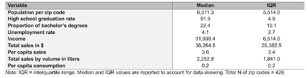

# ADAN-ADEC7900 Group 1

Video Presentation can be viewed [here]().

# Introduction
### Research Question

What is the distribution of per capita sales across geographies? What are the ranks of top 10 geographies for per capita consumption across every liquor category? Are there any outliers that have high per capita sales in only one specific liquor category? Our goal was to analyze regional liquor consumption trends, identify high-spending areas, and uncover patterns in consumer preferences to optimize inventory needs. Focusing on Iowa's four congressional districts—northeast, northwest, southeast, and southwest—we examined overall liquor demand and the popularity of different liquor categories in each region. This analysis could help distribution companies make data-driven decisions about inventory management and resource allocation, ensuring efficient supply chain operations and tailored marketing strategies to meet regional demands effectively. By understanding these consumption trends, distribution companies can better serve their customers and maintain a competitive edge in the market.

### Decision Maker
We planned for our research to be used by the Senior VP of Distribution and Logistics for Iowa Beverage, a beer, wine, and spirit distribution company that serves the state of Iowa. By understanding high-spending areas and consumer preferences, the VP could take the necessary actions to enhance efficiency, reduce waste, and better meet market demands for the 2025-26 fiscal year, ultimately driving profitability and customer satisfaction.

# Data Summary
The two datasets utilized in this study provide insights into both Iowa liquor sales over 2012 - 2016 across a wide range of categories, as well as into various economic and demographic variables across Iowa geographies (zip code, city, or country). The combination of such datasets enabled us to explore regional liquor consumption trends, identify high-spending areas, and uncover potential patterns in consumer preferences.

To provide some specificity, the data on Iowa liquor sales is sourced from the Iowa Department of Revenue while the economic and demographic information is derived from the American Community Survey (ACS).

The first dataset provides aggregated information on liquor sales in Iowa, organized into three geographic levels: zip codes, cities, and counties. Each file contains data on liquor categories (Amaretto, Brandy, Distilled Spirits, Gin, Misc., Rum, Schnapps, Tequila, Vodka, Whiskey), average annual sales in dollars, and average annual volume sold in liters. This structure allows for analysis of regional liquor consumption trends, helping to identify high-spending areas and popular liquor categories. However, the dataset is limited by its aggregation to annual averages, which obscures seasonal or short-term trends. Additionally, the absence of brand-level data or finer geographic details restricts deeper insights into consumer preferences and behaviors. 

As mentioned, the second dataset comes from the ACS. The American Community Survey (ACS) is a yearly survey conducted by the United States Census Bureau that collects data on the U.S. population’s demographics, social characteristics, economy, and housing throughout the course of a year. The ACS surveys about 3.5 million housing units across the U.S. each year, randomly selecting a sample of about 250,000 addresses each month. This dataset provides a comprehensive overview of socio-economic and demographic characteristics, including educational attainment, economic metrics, and racial composition. It captures the percentage of the population with at least a high school diploma and those with a bachelor's degree or higher, alongside the unemployment rate and median earnings. Additionally, it details the total population and its distribution across various racial and ethnic groups, including white, black, Asian, Native Hawaiian, American Indian, and multiracial categories. While the ACS remains both a crucial and credible tool for understanding and addressing community needs and trends, it does come with its implications. Given that the ACS is based on a sample rather than a full count, there is a degree of uncertainty associated with the estimates. Moreover, while the randomization that the ACS relies on can reduce bias, it can also lead to the underrepresentation of certain groups.

In an effort to derive more insightful conclusions, we merged the two datasets and grouped them by geographic information (i.e., zip code, city, county). For example, we combined the data on average annual liquor sales per zip code with ACS data on Iowa zip codes into a singular dataset titled ‘merged_zipcode_data’. This simplification left us with three datasets that we then leveraged for our analysis.

### <ins>Here are quick summaries for the three datasets:<ins> 

**$\color\{Green}{Merged\ Cities\ Data}$**
| Field | Type |
| --- | --- |
| city | character |
| category | character |
| sale.dollars | integer |
| sale.volume | integer |
| high.school | numeric |
| bachelor | numeric |
| unemployment | numeric |
| income | integer |
| population | integer |
| pop.white | integer |
| pop.black | integer |
| pop.indian | integer |
| pop.asian | integer |
| pop.hawai | integer |
| pop.other | integer |
| pop.multi | integer |
| Total size of the dataset | $\color{Red}{328.7\ Kb}$ |
| Total number of rows in the dataset | $\color{Red}{3693}$ |

**$\color\{Green}{Merged\ County\ Data}$**
| Field | Type|
| --- | --- |
| county | character |
| category | character |
| sale.dollars | integer |
| sale.volume | integer |
| high.school | numeric |
| bachelor | numeric |
| unemployment | numeric |
| income | integer |
| population | integer |
| pop.white | integer |
| pop.black | integer |
| pop.indian | integer |
| pop.asian | integer |
| pop.hawai | integer |
| pop.other | integer |
| pop.multi | integer |
| Total size of the dataset| $\color{Red}{89.2\ Kb}$ |
| Total number of rows in the dataset| $\color{Red}{980}$ |

**$\color\{Green}{Merged\ ZipCode\ Data}$**
| Field| Type|
| ---|---|
| zipcode | integer |
| category | character |
| sale.dollars | integer |
| sale.volume | integer |
| high.school | numeric |
| bachelor | numeric |
| unemployment | numeric |
| income | integer |
| population | integer |
| pop.white | integer |
| pop.black | integer |
| pop.indian | integer |
| pop.asian | integer |
| pop.hawai | integer |
| pop.other | integer |
| pop.multi | integer |
| Total size of the dataset| $\color{Red}{325.3\ Kb}$ |
| Total number of rows in the dataset| $\color{Red}{4123}$ |

**<ins>City Dataset:<ins>**
This dataset contains data on liquor sales by city, including categories of alcohol (e.g., whisky, vodka) with corresponding sales in dollars and volume. It also includes socio-economic and demographic variables such as high school and bachelor's degree attainment rates, unemployment rates, median income, total population, and racial breakdowns.
**<ins>Zip Code Dataset::<ins>**
The zip code dataset details liquor sales categorized by alcohol type, along with sales volume and revenue. It also captures demographic data, including education levels, unemployment rates, median income, total population, and racial composition within specific zip codes.
**<ins>County Dataset:<ins>**
This dataset aggregates liquor sales data at the county level, organized by alcohol category with sales volume and dollar amounts. It is supplemented by socio-economic indicators, such as education, unemployment, income, total population, and racial demographics, offering a broader view of trends across counties.
Perhaps it’s also important to note that using a full outer merge in Tableau was crucial to ensure complete data integration. Without it, the merged dataset could be incomplete. In other words, when combining ACS and annual sales data, it was essential to use a full outer merge because some ACS geographies might not have recorded liquor sales, and some sales geographies might not have corresponding ACS data.
Ultimately, combining the liquor sales data with ACS data helped to provide a richer context for analysis, but it did still result in some limitations to consider with respect to our analysis methodology. As mentioned, the sampling error in ACS data introduces uncertainty, particularly for small geographic areas. Temporal mismatches arise because liquor sales data is aggregated annually, while ACS data is collected continuously and reported over different periods. Geographic inconsistencies can occur due to differing boundaries, and both datasets' lack of granularity can obscure finer details. And lastly, contextual gaps exist as ACS data may not capture all factors influencing liquor sales, such as cultural preferences or local regulations. 

### Descriptive Statistics

# Data Analytics
### Analytical Tools & Methods 
We used R, Tableau, and Stata to promote greater flexibility in our approach to the primary research and excursion analysis questions. First, we merged the ACS and liquor sales data in R by city, state, and zip code. Next, we imported the merged data to Tableau, and created initial visualizations for each dataset and noted patterns. Next, we merged the datasets in Tableau to create a single, interactive dashboard of all visualizations directly relevant to the primary research questions. Finally, we used Stata to generate descriptive statistics and run our excursion analyses. We used Stata because it allowed us to conduct more sophisticated statistical tests to support our hypotheses. 

Using the Iowa ACS and liquor sales data, we looked at both descriptive statistics and descriptive graphs (eg. line, map graphs) to investigate the per capita consumption and per capita sales of several liquor categories across the state of Iowa. We created three dynamic dashboards to visualize the results. These dynamic dashboards visualize per capita liquor consumption and sales across various cities, leveraging multiple visualization techniques for comprehensive insights. The line graph highlights the ranking dynamics of the top 10 cities by per capita consumption across liquor categories. A heatmap illustrates the range and intensity of per capita sales, while the box-and-whisker plot identifies outliers in sales by category for these top cities. Additionally, a geospatial map provides an overview of the distribution of liquor sales across cities, offering a regional perspective. Together, these visualizations enable users to explore patterns, outliers, and trends in liquor consumption with ease and interactivity.
While Tableau offers a robust set of analytical tools and methods that enable its users to explore, analyze, and visualize data effectively, it does come with its limitations. The first limitation deals with simultaneous collaboration. Unlike many Google platforms or even GitHub, Tableau lacks built-in features that allow multiple users to work on the same project simultaneously with real-time updates and version control. To optimize both the time and effort each of us were spending on this project, we divided the responsibilities by geographic levels—zip code, city, and county—so each team member could focus on answering the three research questions independently. Because Tableau doesn’t offer collaborative perks, we had to constantly communicate to ensure consistency in our findings and integrate our work seamlessly. 
In order to collaborate on analyzing and visualizing our data inTableau as well as publicly share our analytical story, we created a public GitHub repository. The main victory of Github was that it made it easy for us to collaborate virtually, which ultimately was instrumental in drafting our report, writing and debugging code, and uploading the visualizations we created in Tableau to one central location. We also found Github’s extensive resources to be invaluable for addressing specific questions or issues. Additionally, its integration with R and other development and analysis tools helped facilitate the seamless incorporation of syntax directly into markdown files on GitHub, streamlining the workflow for data analysis and reporting. The main challenge was the learning curve associated with using GitHub for the first time. Another significant challenge we encountered involved uploading files and posting content effectively. When we went to upload the data, we were met with strange permission errors and struggled to get the data that was uploaded by one member to merge with the repository and show up for the entire group. Overall however, the Github repository made it very easy to collaborate and have access to the most updated version of our analysis files.

First, we merged the ACS and liquor sales data in R by city, state, and zip code. Next, we imported the data to Tableau, and created initial visualizations for each dataset and noted patterns. Next, we merged the datasets in Tableau to create a single, interactive dashboard of all visualizations directly relevant to the primary research questions. Finally, we used Stata to generate descriptive statistics and run our excursion analyses. We used Stata because it allowed us to conduct more sophisticated statistical tests to support our hypotheses. 
Finally, to complete our excursion analyses, we loaded the zip code dataset into Stata. 
We conducted our analyses in Tableau. Using the two data sets that were mentioned above, we looked at both descriptive statistics and descriptive graphs (eg. line, map graphs) to investigate the per capita consumption and per capita sales of several liquor categories across the state of Iowa. We created three dynamic dashboards to visualize the results. These dynamic dashboards visualize per capita liquor consumption and sales across various cities, leveraging multiple visualization techniques for comprehensive insights. The line graph highlights the ranking dynamics of the top 10 cities by per capita consumption across liquor categories. A heatmap illustrates the range and intensity of per capita sales, while the box-and-whisker plot identifies outliers in sales by category for these top cities. Additionally, a geospatial map provides an overview of the distribution of liquor sales across cities, offering a regional perspective. Together, these visualizations enable users to explore patterns, outliers, and trends in liquor consumption with ease and interactivity.
While Tableau offers a robust set of analytical tools and methods that enable its users to explore, analyze, and visualize data effectively, it does come with its limitations. The first limitation deals with simultaneous collaboration. Unlike many Google platforms or even GitHub, Tableau lacks built-in features that allow multiple users to work on the same project simultaneously with real-time updates and version control. To optimize both the time and effort each of us were spending on this project, we divided the responsibilities by geographic levels—zip code, city, and county—so each team member could focus on answering the three research questions independently. Because Tableau doesn’t offer collaborative perks, we had to constantly communicate to ensure consistency in our findings and integrate our work seamlessly. 
In order to collaborate on analyzing and visualizing our data inTableau as well as publicly share our analytical story, we created a public GitHub repository. The main victory of Github was that it made it easy for us to collaborate virtually, which ultimately was instrumental in drafting our report, writing and debugging code, and uploading the visualizations we created in Tableau to one central location. We also found Github’s extensive resources to be invaluable for addressing specific questions or issues. Additionally, its integration with R and other development and analysis tools helped facilitate the seamless incorporation of syntax directly into markdown files on GitHub, streamlining the workflow for data analysis and reporting. The main challenge was the learning curve associated with using GitHub for the first time. Another significant challenge we encountered involved uploading files and posting content effectively. When we went to upload the data, we were met with strange permission errors and struggled to get the data that was uploaded by one member to merge with the repository and show up for the entire group. Overall however, the Github repository made it very easy to collaborate and have access to the most updated version of our analysis files.

